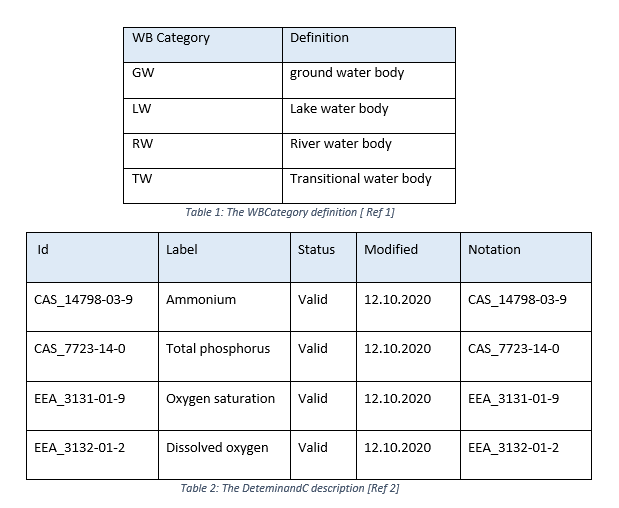
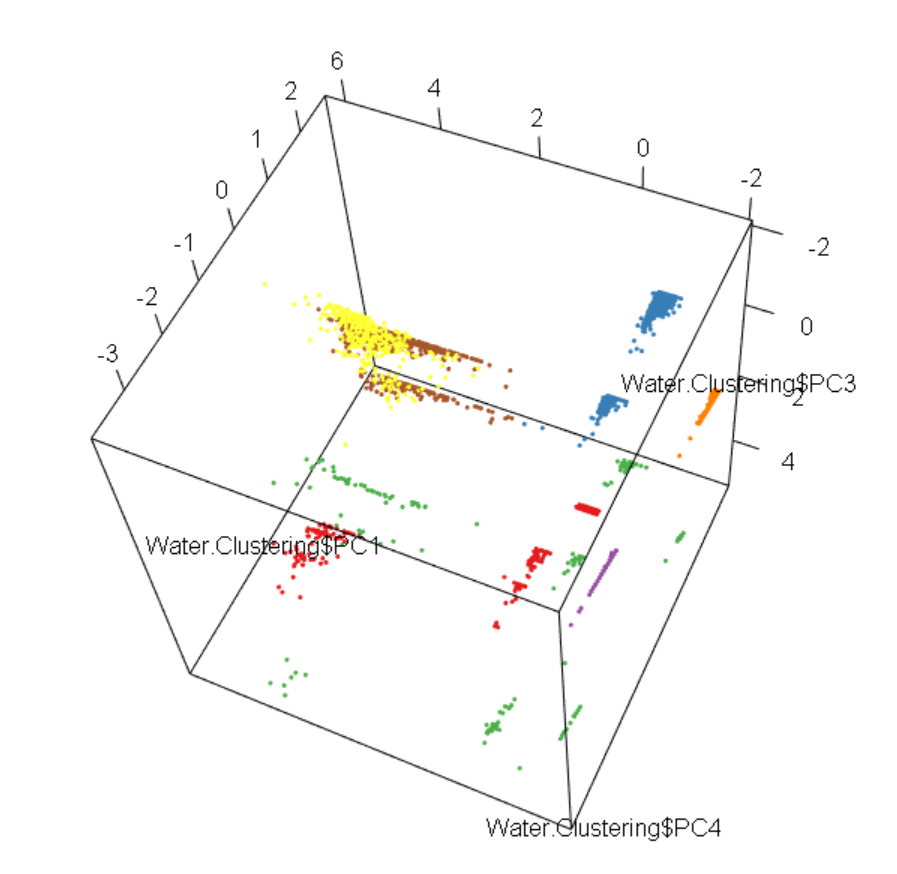
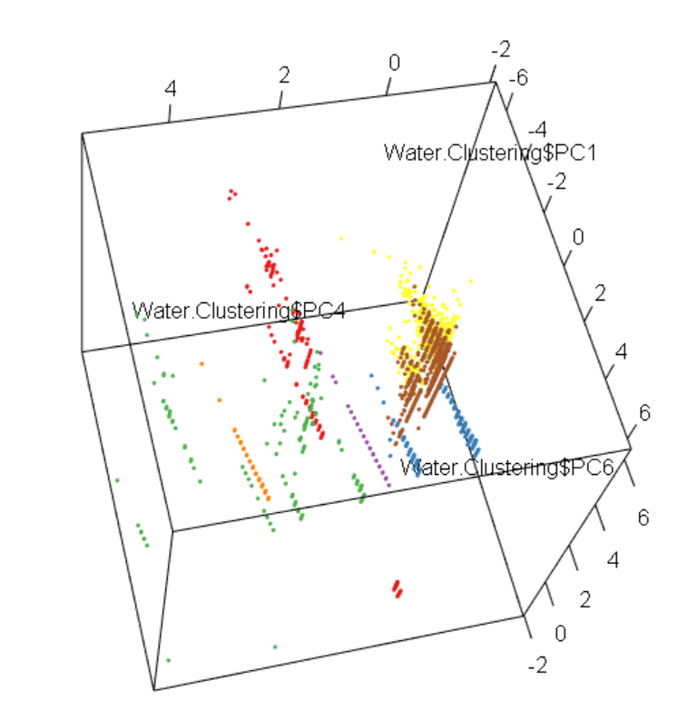

# Task 1 - Dataset Exploration and Classification
```{r setup, include=FALSE}
knitr::opts_chunk$set(echo = TRUE)
```
```{r include = FALSE}
# Clear the Global Environment

rm(list =ls())
```

```{r include = FALSE}
library(caret)
library(datasets)
library(partykit)
library(e1071)
library(C50)
library(RWeka)
library(rattle)
library(dplyr)

```
## Task 1a - Dataset Exploration 

Background Information is shown in Tables below:


{Width=60%}


### Load and View the files 

```{r} 

# Loading the three '.csv' Data files into R ,echo = FALSE to suppress code and only show display on R Markdown output

DataSampWater1 <- read.csv(file= "../data/sampleWater1.csv",stringsAsFactors = TRUE, header = TRUE,sep = ",")

DataSampWater2 <- read.csv(file= "../data/sampleWater2.csv",stringsAsFactors = TRUE, header = TRUE,sep = ",")

TestWater <- read.csv(file= "../data/testWater.csv",stringsAsFactors = TRUE, header = TRUE,sep = ",")

```


```{r}

# Viewing the data set in a separate Window

#View(DataSampWater1)
#View(DataSampWater2)
#View(TestWater)

```
### Inspecting the data files

```{r}
#Looking at the number of rows and columns for the datasets

dim(DataSampWater1)
dim(DataSampWater2)
dim(TestWater)
```

```{r}
# Look at the column names for the datasets

 colnames(DataSampWater1)
 colnames(DataSampWater2)
 colnames(TestWater)

```

```{r}
# Find the number of rows / instances 

nrow(DataSampWater1)
nrow(DataSampWater2)
nrow(TestWater)

```

```{r}
# Looking at the structure of the data set

str(DataSampWater1)
str(DataSampWater2)
str(TestWater)

```
```{r}
#Inspecting first and last 10 lines

head(DataSampWater1, n=10)
tail(DataSampWater1, n=10)

```
```{r}
#Inspecting first and last 10 lines

head(DataSampWater2, n=10)
tail(DataSampWater2, n=10)

```
```{r}
#Inspecting first and last 10 lines

head(TestWater, n=10)
tail(TestWater, n=10)

```

```{r echo=FALSE}
# Summary of the datasets

summary(DataSampWater1)
summary(DataSampWater2)
summary(TestWater)
```


```{r}
#Basic plot of the individual datasets

plot(DataSampWater1,main = "Plot of DataSampWater1")
plot(DataSampWater2,main = "Plot of DataSampWater2")
plot(TestWater,main ="Plot of TestWater")
```
The attributes and the relations can be seen above. The levels of the categorical variables can also be seen as a distinct vertical lines and the variations in range for numerical attributes is seen as distinct horizontal lines.A closer look at the distributions is done with the plots below.

### Class distribution
```{r}
# Checking for class distribution in the three data sets

plot(DataSampWater1$WBCategory, main = "DataSampWater1",xlab ="WB Category ", ylab ="Total Count", col = "steel blue" )
count(DataSampWater1,DataSampWater1$WBCategory)       # Looking at actual numbers of WBCategory in DataSampWater1

plot(DataSampWater2$WBCategory,main = "DataSampWater2", xlab ="WB Category ", ylab ="Total Count", col = "firebrick" )
count(DataSampWater2,DataSampWater2$WBCategory)       # Looking at actual numbers of WBCategory in DataSampWater2

plot(TestWater$WBCategory,main = "Data From TestWater", xlab ="WB Category ", ylab ="Total Count", col = "darkmagenta" )
count(TestWater,TestWater$WBCategory)                         # Looking at actual numbers of WBCategory in DataSampWater2


```

Looking at the class distributions and summary above:

•	Dataset is imbalanced for DataSampWater 1 - out of 3146 instances, LW has a lot more instances (2941), than RW(140), GW(64) and only one for TW. The distribution is similar for DatasampWater2 and TestWater as well. 

•	Majority of the data provided is for LW (Lake water) – so data could be skewed for it, which is not ideal.

•	There is only one example for TW(Transitional water) in each of the sample dataset to be used for training and hence predicting it will be unlikely . 

•	The Test Water dataset has 5 instances of TW which is more than the combined training set. This data would have been more useful in the training set.


### Relationships between attributes

```{r}

#### is there any obvious correlation between attribute value according to class.

by(DataSampWater1,DataSampWater1$WBCategory, summary)


 # In GW, only one method (EN 25813:1992) is used and all of them contains DeterminandC of type 'EEA_3132-01-2'.
 # In RW, only one method (EN 25813:1992)  is used and contains two DeterminandC (EEA_3131-01-9,EEA_3131-01-2) are shown.
 # In LW there is a good but uneven  distribution of methods and determinandC types.
 # All attributes of TW are shown for the single sample in the data set.
 # The mean value for TW and are in the lower range (under 6), compared to the other two.
 # It is easier to check the categorical attributes  with plots.

```

From the table above, 'Method' type used and 'determinandC' found; are not distributed evenly across the classes. LW is the only class to have an good but uneven distribution across the methods and determinandC types.
 
### Distribution of DeterminandC w.r.t WBCategory 
 
```{r}
ggplot(DataSampWater1, aes(x=WBCategory,determinandC )) +
    geom_point(shape=24,fill = "red",size = 3) + ggtitle("DataSampWater1 - Relation between WBCategory and Determinand") + theme(plot.title = element_text(color="dark blue", size=12, face="bold.italic"))

ggplot(DataSampWater2, aes(x=WBCategory,determinandC )) +
    geom_point(shape=24,fill = "red",size = 3) + ggtitle("DataSampWater2 - Relation between WBCategory and DeterminandC")+ theme(plot.title = element_text(color="dark blue", size=12, face="bold.italic"))

ggplot(TestWater, aes(x=WBCategory,determinandC )) +
    geom_point(shape=24,fill = "red",size = 3)+ ggtitle("TestWater - Relation between WBCategory and DeterminandC")+ theme(plot.title = element_text(color="dark blue", size=12, face="bold.italic"))
```
The above plots are useful in seeing the attribute of ‘DeteminandC’ with respect to ‘WBCategory’. All types of ‘DeterminanC’ can be seen in LW. GW and TW only have EEA_3132-01-2 in it. RW has the two ‘EEA’ types in it , which is associated with oxygen.

### Distribution of between the WB category assigned and the determinandC

```{r}


# plotting levels of Determinand code: Ammonium , Total Phosphorus ,Dissolved Oxygen , Oxygen Saturation in WBCategory

ggplot(DataSampWater1,aes(x =WBCategory ,fill = determinandC )) + geom_bar(width = 0.5) + xlab("WBCategory") + ylab("Total Count")+ ggtitle("DataSampWater1 - Distribution of DeterminandC in  WBCategory") + theme(plot.title = element_text(color="dark blue", size=12, face="bold.italic"))+ scale_fill_discrete(labels = c("CAS_14798-03-9: Ammonium","CAS_7723-14-0: Total Phosphorus","EEA_3131-01-9: Dissolved Oxygen","EEA_3132-01-2: Oxygen Saturation"))


ggplot(DataSampWater2,aes(x =WBCategory ,fill = determinandC )) + geom_bar(width = 0.5) + xlab("WBCategory") + ylab("Total Count")+ ggtitle("DataSampWater2 - Distribution of DeterminandC in  WBCategory") + theme(plot.title = element_text(color="dark blue", size=12, face="bold.italic"))+ scale_fill_discrete(labels = c("CAS_14798-03-9: Ammonium","CAS_7723-14-0: Total Phosphorus","EEA_3131-01-9: Dissolved Oxygen","EEA_3132-01-2: Oxygen Saturation"))


ggplot(TestWater,aes(x =WBCategory ,fill = determinandC )) + geom_bar(width = 0.5) + xlab("WBCategory") + ylab("Total Count")+ ggtitle("TestWater - Distribution of DeterminandC in  WBCategory") + theme(plot.title = element_text(color="dark blue", size=12, face="bold.italic"))+ scale_fill_discrete(labels = c("CAS_14798-03-9: Ammonium","CAS_7723-14-0: Total Phosphorus","EEA_3131-01-9: Dissolved Oxygen","EEA_3132-01-2: Oxygen Saturation"))

```

Oxygen Saturation is found in all four of the ‘WBCatergory’, which is to be expected.
Ammonium and Phosphorus is found only in Lake water which is interesting in terms of an environmental perspective. 

### Relationship between the WBcategory and the siteIDscheme


```{r}
# Plotting the siteIDScheme in relation to WBCategory for all three Datasets

ggplot(DataSampWater1,aes(x = siteIDScheme,fill = WBCategory)) + geom_bar(width = 0.5)+ggtitle("SampWater1 - Relation between WBCategory and siteIDScheme") + theme(plot.title = element_text(color="dark blue", size=12, face="bold.italic"))

ggplot(DataSampWater2,aes(x = siteIDScheme,fill = WBCategory)) + geom_bar(width = 0.5) + ggtitle("SampWater2 - Relation between WBCategory and siteIDScheme") + theme(plot.title = element_text(color="dark blue", size=12, face="bold.italic"))

ggplot(TestWater,aes(x = siteIDScheme,fill = WBCategory)) + geom_bar(width = 0.5) + ggtitle("TestWater- Relation between WBCategory and siteIDScheme") + theme(plot.title = element_text(color="dark blue", size=12, face="bold.italic"))
```


```{r echo=FALSE}
# Looking at the summary numbers w.r.t siteIDScheme for all three Datasets

by(DataSampWater1,DataSampWater1$siteIDScheme, summary)
by(DataSampWater2,DataSampWater2$siteIDScheme, summary)
by(TestWater,TestWater$siteIDScheme, summary)
```
Majority of the site Id is assigned to euMonitoringSiteCode ,2992 out of 3146 .The summary also shows that this siteID has lots of NAs in it for standard deviation. 290 compared to eionetMonitoringSiteCode which has 24 Nas in standard deviation and has 154 out of the 3146 sites assigned to it. will need to look into which WBCategory the NAs fall into.
The only instances for TW for this entire training dataset is in einoetMonitoringSiteCode. Similar distribution can be seen for DataSampWater2 and TestWater.There is a good distribution of method and determinandC in both the site Ids.


### Relationship between the WB category assigned and the method

```{r}
# Plotting the method in relation to WBCategory for all three Datasets

ggplot(DataSampWater1,aes(x = method ,fill = WBCategory)) + geom_bar(width = 0.5) + xlab("CEN/ISO code of the analytical method") + ylab("Total Count")+ggtitle("DataSampWater1 - Relation between WBCategory and Method") + theme(plot.title = element_text(color="dark blue", size=12, face="bold.italic"))

ggplot(DataSampWater1,aes(x = method ,fill = WBCategory)) + geom_bar(width = 0.5) + xlab("CEN/ISO code of the analytical method") + ylab("Total Count")+ggtitle("DataSampWater2 - Relation between WBCategory and Method") + theme(plot.title = element_text(color="dark blue", size=12, face="bold.italic"))

ggplot(DataSampWater1,aes(x = method ,fill = WBCategory)) + geom_bar(width = 0.5) + xlab("CEN/ISO code of the analytical method") + ylab("Total Count")+ggtitle("TestWater - Relation between WBCategory and Method") + theme(plot.title = element_text(color="dark blue", size=12, face="bold.italic"))

```

Only one method (EN 25813:1992) is used on  all the WBCategories.All other methods are applied only on LW.


### Relationship between the NSamples and  Method in WBcategory

```{r}

# Plotting the No of samples and  method w.r.t  WBCategory for all three Datasets

ggplot(DataSampWater1,aes(x = NSamples  ,fill = WBCategory)) + geom_bar(width = 0.5) + facet_wrap(~method) +   xlab("Number of Samples") + ylab("Total Count")+ggtitle("DataSampWater1 - Relation between NSamples and  Method in WBcategory") + theme(plot.title = element_text(color="dark blue", size=12, face="bold.italic"))

ggplot(DataSampWater2,aes(x = NSamples  ,fill = WBCategory)) + geom_bar(width = 0.5) + facet_wrap(~method) +   xlab("Number of Samples") + ylab("Total Count")+ggtitle("DataSampWater2 - Relation between NSamples and  Method in WBcategory") + theme(plot.title = element_text(color="dark blue", size=12, face="bold.italic"))

ggplot(TestWater,aes(x = NSamples  ,fill = WBCategory)) + geom_bar(width = 0.5) + facet_wrap(~method) +   xlab("Number of Samples") + ylab("Total Count")+ggtitle("DataWater - Relation between NSamples and  Method in WBcategory") + theme(plot.title = element_text(color="dark blue", size=12, face="bold.italic"))
```

Majority of the instances take two samples and this is not dependent on the method used.

### Relationship between NSamples and DeterminandC in WBcategory

```{r}
# Plotting the No of samples and  Determinand Code w.r.t  WBCategory for all three Datasets

ggplot(DataSampWater1,aes(x = NSamples  ,fill = WBCategory)) + geom_bar(width = 0.5) + facet_wrap(~determinandC) +   xlab("Number of Samples") + ylab("Total Count")+ggtitle("DataSampWater1 - Relation between NSamples and DeterminandC in WBcategory") + theme(plot.title = element_text(color="dark blue", size=12, face="bold.italic"))

ggplot(DataSampWater2,aes(x = NSamples  ,fill = WBCategory)) + geom_bar(width = 0.5) + facet_wrap(~determinandC) +   xlab("Number of Samples") + ylab("Total Count")+ggtitle("DataSampWater2 - Relation between NSamples and DeterminandC in WBcategory") + theme(plot.title = element_text(color="dark blue", size=12, face="bold.italic"))

ggplot(TestWater,aes(x = NSamples  ,fill = WBCategory)) + geom_bar(width = 0.5) + facet_wrap(~determinandC) +   xlab("Number of Samples") + ylab("Total Count")+ggtitle("TestWater - Relation between NSamples and DeterminandC in WBcategory") + theme(plot.title = element_text(color="dark blue", size=12, face="bold.italic"))
```

No Relationship between number of samples and DeterminandC.

**Notes for Task 1:** 

* The data set has missing values in attribute sd , some of these can be converted to zero , as the sample size is 1. Not enough information provided to recalculate sd.  Others need to be checked and decision needs to be taken whether to replace them with mean values or remove them.

*	All the media attribute (type of media monitored) is of type - Water, no info on sediment at all, which could indicate missing data.

*	All the analysed attribute (fraction of sample analysed) if of type - total, no info on dissolved or SPM, which could indicate missing data.

*	Majority of the SiteIDScheme given is of Type euMonitoringSiteCode - something to be aware of.

*	A large amount of data is for Lake Water, so the data can be heavily skewed towards it and just two instances for Transitional Water in the combined training dataset, which is bad.

**Highlights of the Water data sets:**

*	Data given looks at categories of four Water Body Categories - Ground Water(GW),Lake Water(LW),River Water(RW),Transitional Water (TW)

*	There are two types of Site monitoring IDs a majority of which uses euMonitoringSiteCode.

*	Data looks at Ammonium, Phosphorus, Dissolved Oxygen 
and Oxygen Saturation in the water samples.

*	Oxygen Saturation is found in all four of the ‘WBCategory’, which is to be expected.

*	Ammonium and Phosphorus is found only in Lake water which is interesting in terms of an environmental perspective. 

*	There are more instances of TW (5) in TestWater, than in the DataSampWater1 and DataSampWater2 (both have one each) , which is interesting. The main difference in the no of WBcategories in the TestWater compared to DataSampWater2 is the addition of 4 TWs. This could be interesting.


## Task 1b : Preprocessing data 

```{r}

## Remove the analysed and media - from SampWater 1 , SampWater 2 and TestWater

DataSampWater1$analysed<- NULL
DataSampWater1$media<- NULL
#View(DataSampWater1)              # check if removed successfully 
DataSampWater2$analysed<- NULL
DataSampWater2$media<- NULL
TestWater$analysed<- NULL
TestWater$media<- NULL
#View(DataSampWater2)              # check if removed successfully 
#View(TestWater)                   # check if removed successfully 


```


### Preprocessing - DataSampwater1
 

```{r}

# Remove NA in sd where sample Size = 1 and replace with 0

any(is.na(DataSampWater1$sd))   # check for any NAs in sd column 
sum(is.na(DataSampWater1$sd))   # gives the total number of NAs in sd column 

DataSampWater1$sd = ifelse((is.na(DataSampWater1$sd) & (DataSampWater1$NSamples == 1)),0,DataSampWater1$sd) # Check and replace with zero
#view(DataSampWater1)           # View data set to see if it worked.
sum(is.na(DataSampWater1$sd))   # Check to see the number of NAs left after replacement


```
Only 10 values left of NA - after replacing suitable NAs  as zero - next step: remove or replace with approximate value (mean /Range rule).

```{r}

#Code to omit rows with NA in sd attribute as % of NAs are very low and  in the Category low on data.

nrow(DataSampWater1)            # to remember the no of rows
DataSampWater1 <- na.omit(DataSampWater1)
nrow(DataSampWater1)            # rows numbers after deletion
#View(DataSampWater1)           # check to confirm the changes 
any(is.na(DataSampWater1$sd))   # Check to see if any NAs left after deletion in sd column 
any(is.na(DataSampWater1))      # Check to see if any  other NAs in the data set 
  
```
No NAs left in the DataSampWater 1 

### Preprocessing -DataSampWater 2
```{r}
#remove NA in sd where sample Size = 1 and replace with 0

any(is.na(DataSampWater2$sd))    #check for any NAs in the sd column  
sum(is.na(DataSampWater2$sd))    # Total number of NAs in the sd column 

DataSampWater2$sd = ifelse((is.na(DataSampWater2$sd) & (DataSampWater2$NSamples == 1)),0,DataSampWater2$sd) # check and replace with 0
#view(DataSampWater2)
sum(is.na(DataSampWater2$sd))    # Total number of NAs left after replacement in the sd column 
```
```{r}
# Code to omit rows with NA in sd attribute

nrow(DataSampWater2)            # to remember the number of rows
DataSampWater2 <- na.omit(DataSampWater2)
nrow(DataSampWater2)            # number of rows  after deletion
#View(DataSampWater2)
any(is.na(DataSampWater2$sd))   # check for any NAs left in the sd Column  
any(is.na(DataSampWater2))      # check for any NAs left in the data set  
  
```
### Preprocessing - Water
```{r}

 # remove NA in sd where sample Size = 1 and replace with 0
any(is.na(TestWater$sd))            # check for any NAs left in the sd Column 
sum(is.na(TestWater$sd))            # find total number of NAs in the sd column 

TestWater$sd = ifelse((is.na(TestWater$sd) & (TestWater$NSamples == 1)),0,TestWater$sd) # replace sd with zero for Nsample = 1
#view(TestWater)          
sum(is.na(TestWater$sd))            # check for number of NAs left after replacement
```
```{r}
# Code to omit remaining rows with NA in sd attribute
nrow(TestWater)                     # to remember the rows
TestWater <- na.omit(TestWater)
nrow(TestWater)                     # rows numbers after deletion
#View(TestWater)
any(is.na(TestWater$sd))            # check for any NAs left in the sd Column
any(is.na(TestWater))               # check for any NAs left in the data set  
  
```

## Combining the two Data sets

```{r}
# Combine the two data sets into one - change combined name to Water 

nrow(DataSampWater1)                # check the no of rows in DataSampWater 1
nrow(DataSampWater2)                # check the no of rows in DataSampWater 2
Water <- rbind(DataSampWater1, DataSampWater2)# combine the two as Water
nrow(Water)                         # check the modified no of rows
# View(Water)                       # check to confirm the changes 

```

## Task 1b : Two Tree classifers and one Instance based Classifiers

Choose  two  tree classifiers and one Instance based classifier with common evaluation method.

Chosen: 

* Tree Classifiers:
  + J48
  + LMT
* Instance Based Classifier:
  + Knn
* Evaluation Method:
  + Cross Validation (3 x 10-fold)
  

```{r}
#Training the  J48 and LMT  classifiers

#setting ctrl as Cross validation 

ctrl <- trainControl(method = "repeatedcv",
                     repeats = 3,             # modified from 3 to 1 (temporarily) to save time during runs
		      verboseIter=FALSE)                  # run information is not outputted

# K Value: As a trade-off between high variance (due to low k value) and high bias (due to High k values). Default value of 10  has been kept, which has been shown to provide results that have a more balanced error rate.  The K value chosen also splits the data sample into equal groups, which is perred to keep the sample of the scores (for model skills) are all equivalent.
```

```{r warning=FALSE}

# Train J48 model

set.seed(123)
j48mod <- train(WBCategory ~ ., data = Water,
             method = "J48",
             tuneLength = 12,                 # is the granularity of the tuning parameter grid
             metric = "Accuracy",             # Accuracy is the metric chosen
             trControl = ctrl)

# Train LMT model 

set.seed(123)                                 # use same seed as above  
lmtmod <- train(WBCategory ~ ., data = Water,
             method = "LMT",
             tuneLength = 12,                 # This is the granularity of the tuning parameter grid
             metric = "Accuracy",             # Accuracy is the metric chosen
             trControl = ctrl)

```

## Additional Preprocessing for Knn

```{r}
# One Hot encoding (OHE)
# Step 1: remove class from the dataset and save as another dataset 
# Step 2: binaries those values 
# Step 3: bind the binarised value to the removed class 
# Step 4: check the new dataset 


# Step 1: make a copy
noClass <-Water

# remove the class - it is not transformed
noClass$WBCategory <- NULL


# Step 2: binaries those values 

set.seed(123)                                 # use same seed as above 

#binarise nominal attributes

binaryVars <- dummyVars(~ ., data = noClass)
newWater <- predict(binaryVars, newdata = noClass)

# Step 3: bind the binarised value to the removed class 

binaryWater <-cbind(newWater, Water[2])


# Step 4: check the new dataset 

#View(binaryWater)
head(binaryWater, 14)
```
The Water dataset has been correctly one hot encoded

```{r}

# Normalise and Train the OHE dataset for Knn - training set

set.seed(123) 
norm.knn <- train(WBCategory ~ ., data =binaryWater, 
method="knn", 
tuneLength = 12,                           
metric = "Accuracy",
preProcess=c("range"), trControl=ctrl)    # Normalisation

#Check the normalised data - as the output of train cannot be viewed

 preProcValues <- preProcess(binaryWater, method = c("range"))
 WaterNormalised <- predict(preProcValues, binaryWater)
 #View(WaterNormalised)
 head(WaterNormalised, 5)
 
#To check that all the values are on the scale [0, 1] use the summary function.
 summary(WaterNormalised)

```
The Water dataset has been now One hot encoded and normalised correctly, the values are in the 0 to 1 scale.

## Additional Preprocessing for Knn - Test Water

```{r}
# One Hot encoding (OHE) and normalise

# Step 1: remove class from the dataset and save as another dataset 
# Step 2: binaries those values 
# Step 3: bind the binarised value to the removed class 
# Step 4:normalise the data
# Step 5: check the new dataset 


# Step 1: make a copy
TestnoClass <-TestWater

# remove the class - it is not transformed
TestnoClass$WBCategory <- NULL


# Step 2: binaries those values 

set.seed(123)                                       # use same seed as above 

#binarise nominal attributes
TestbinaryVars <- dummyVars(~ ., data = TestnoClass)
newTestWater <- predict(TestbinaryVars, newdata = TestnoClass)

# Step 3: bind the binarised value to the removed class  

TestbinaryWater <-cbind(newTestWater, TestWater[2])

# Step 4:normalise the  one hot encoded data


 TestpreProcValues <- preProcess(TestbinaryWater, method = c("range"))
 TestWaterNormalised <- predict(TestpreProcValues, TestbinaryWater)

# Step 5: check the new dataset 

 #View(TestWaterNormalised)
 head(TestWaterNormalised, 5)

```
Test water is now one hot encoded and Normalised.
```{r }

##Comparing training results on the Merged , Preprocessed dataset

set.seed(123)

# outputs a confusion matrix showing average of instances
confusionMatrix.train(j48mod,norm="average")
confusionMatrix.train(lmtmod, norm="average")
confusionMatrix.train(norm.knn, norm="average")


# norm = overall vs norm = average. Which one to use?
# Main difference is that norm = overall is a percentages, which is easier to interpret
# however ,as TW is very small amount of the total instances ,the percentage is very small and taken as zero, hence norm=average was chosen even though the classification of TW was wrong.
# Accuracy is still the same for both options.

```
for Confusion Matrix norm = "average" was chosen for reasons mentioned in comments above.

## Task 1b : Comparison of performance of the Algorithms on Training set


**Accuracy:** Good values of accuracy for all three algorithms .J48- 97.17% , LMT-97.06%, KNN-97.07% .However,it should be be noted that for imbalanced datasets like this one accuracy alone should not be taken as a measure of performance.

**Confusion Matrix:** Looking at the True positives and True negatives,J48 performs slightly better for GW,KNN for LW,LMT for TW. Similar performance in J48 and LMT for RW.False positives and negatives are similar overall.

**Evaluation method and Size:** K -fold Cross Validation develops several models using different portion of the data and hence is suitable for data of limited size [Ref 3], like this one. 

**K Value:** As a trade-off between high variance (due to low k value) and high bias (due to High k values) ,  k = 10 has been chosen, which has been shown to provide results that have a more balanced error rate [Ref 4]. The K value chosen also splits the data sample into equal groups, which is perred to keep the sample of the scores (for model skills) are all equivalent. 

**TuneLength:** The granularity of the tuning parameter grid is chosen to be 12, which is better than the default value of 10. 

**Pre-processing:** The correction of NA values of sample size = 1, has allowed the retention of majority of the total NAs in the dataset.After replacement ,  there were 10  in the training set and 5 in the TestWater. These were not in a class with extremely low data (for example,TW) and hence, the rows were removed.  

**Additional Pre-processing for KNN:** One Hot Encoding and Normalisation was done for KNN, as the range of data in the numerical category was quite wide.The higher values would have overwhelmed the smaller values in the Euclidean distance calculations.

```{r}

#Checking statistical significance

# collect resamples
results <- resamples(list(j48=j48mod,LMT=lmtmod, KNN=norm.knn))
# show results for each model
results 

#plot results
scales <- list(x=list(relation="free"), y=list(relation= "free"))
dotplot(results, scales=scales, conf.level = 0.95)
dotplot(results, scales=scales, conf.level = 0.50)
dotplot(results, scales=scales, conf.level = 0.41)
dotplot(results, scales=scales, conf.level = 0.40)


# scatterplot
splom(results) # displays all the accuracies for each of the runs for all three algorithms

```

## Task 1c : Deeper Comparison of the Algorithms with Training Set


*For this Data set: 

+ As TW has very few instances, LMT correctly classifying it when the other two didn't is noteworthy.
+ If the Accuracy and Kappa scales overlap and hence the difference is not statistically significant.
+ At confidence of 95%, the error bars of all the three algorithms  overlap and there is no statistical significance.The confidence level needs to be reduced significantly to see a separation.
+ At confidence of 50%, a possibility of separation between J48 and KNN can be seen.
+ At confidence of 41%, a slight overlap can be seen between J48 and KNN.
+ At confidence of 40%, there is a clear separation between J48 and KNN.
+ The scatter plot shows no major difference in distribution of accuracies for each of the algorithm.


The Algorithms now need to be tested to determine the real accuracy of the classifiers.


## Task 1d : Testing the dataset

1d. Test the 3 models you trained using the water dataset on the TestWater
dataset and compare their performance. [Word limit: 100, excluding code
and/or plots]

```{r}
## Testing the j48 classifier

j48TestResult <- predict(j48mod, newdata = TestWater, type="raw") # test
confusionMatrix(j48TestResult, TestWater$WBCategory)              # display result metric

```
```{r}
# summary of training set for comparison

summary(j48mod$finalModel)
```

```{r}

## Testing the LMT classifier

jmtTestResult <- predict(lmtmod, newdata = TestWater, type="raw") # test
confusionMatrix(jmtTestResult, TestWater$WBCategory)              # display result metric

```

```{r}
# summary of lmt training set for comparison

summary(lmtmod$finalModel)
```

```{r}

## Testing the KNN classifier

#View(TestWaterNormalised)

knnTestResult <- predict(norm.knn, newdata = TestWaterNormalised,type = "raw" ) # test with normalised test set
confusionMatrix(knnTestResult, TestWaterNormalised$WBCategory)    # display result metric

```


**For J48:**

Slightly lower accuracies test set (97.26%) compared to the training (97.5962%) a which is as expected. The 95% confidence interval is(0.9654,0.9787). 
Kappa takes into account random chance agreement with the classifier and is a normalised statistic and hence can be used to as metric to evaluate among classifiers. For J48, the Kappa value is 0.7691 which is high. 

From Statistics, larger number of instances (44 out of 55) in GW has been correctly classified. The remaining 11 have been incorrectly classified as LW.
In LW, 2297 out of 2341 instances are correctly classified. The incorrect classifications are: 12 as GW , 30 as RW and 2 as TW.
In RW, 75 out of 88 are correctly classified. The incorrect classifications are: 10 as LW and 3 as TW. No correct classification for TW.

**For LMT:**
Slightly lower accuracies test set (97.71%) compared to the training (98%) a which is as expected. The 95% confidence interval is(0.9704,0.9826). 
The Kappa for LMT is 0.8 which is slightly higher than for J48.
From Statistics, larger number of instances (44 out of 54) in GW has been correctly classified. 9 have been incorrectly classified as LW and one incorrectly classified as RW.

In LW, 2301 out of 2337 instances are correctly classified. 12 have been incorrectly classified as GW and 24 incorrectly classified as RW.
In RW, 80 out of 88 are correctly classified, with 8 incorrectly classified as LW.

**For KNN:**
Accuracy at 91.87% which is higher than LMT and j48. The 95% confidence interval is (0.9072, 0.9291). However, the Kappa is very low (0.4).
From Statistics, lower number of instances (55 out of 188) in GW has been correctly classified. The incorrect classifications are: 91 as LW, 42 as RW.
In LW, has better results with 2227 out of 2229 instances are correctly classified. The incorrect classifications are: 1 as GW, 63 as RW and 5 as TW.
In RW and TW no instances have been picked up as correctly or incorrectly classified. This could be acceptable for TW as it has very few instances, but for RW there are enough instances and the training model predicted instances in it. The Test section need to be examined further and the overall process may need to be re-thought of in terms of RW.


# Task 2: Clustering and Additional Insights


```{r}

# Additional Libraries for this section 

library(RColorBrewer)
library(scales)
library(cluster)
library(rgl)
library(fpc)
library(pvclust)

```

## Preprocess for K-Means 

```{r}

set.seed(1)     

#binarise nominal attributes - one-hot encoding                     

binaryVars3 <- dummyVars(~ ., data = Water)                     
newWater3 <- predict(binaryVars3, newdata = Water)

#head(newWater2)                                                   # check if WBCategory is now encoded.

#Apply centering, scaling and principal components analysis

pca_Water <- preProcess(newWater3,                             
                    method = c("center", "scale", "pca"))


Water.Clustering <- predict(pca_Water, newdata = newWater3)    

head(Water.Clustering,5)                                           # check the results of PCA and clustering

```

### Decide the number of Clusters - Elbow Method

```{r}
set.seed(1)

# Code for Elbow method
wss1 <- (nrow(Water.Clustering)-1)*sum(apply(Water.Clustering,2,var))


for (i in 2:15) 
	wss1[i] <- sum(kmeans(Water.Clustering, centers=i, nstart=100, iter.max=1000)$withinss)
plot(1:15, wss1, type="b",main="Elbow Method to Determine 'k'", xlab="k= Number of Clusters", ylab="Within groups sum of squares")

```
The Elbow isn't very clear !

### Decide the number of clusters - Silhouette Method

The silhouette method may give a different best number of clusters.

```{r}

# For each value of k, k-means is applied. The average silhouette is calculated.
set.seed(1)

sil <-NULL
for (i in 2:15) 
{ 
  res <- kmeans(Water.Clustering, centers = i, nstart = 25)
  ss <- silhouette(res$cluster, dist(Water.Clustering))
  sil[i] <- mean(ss[, 3])
}
plot(1:15, sil, type="b", main = "Silhouette Method to Determine 'k'", xlab="k= Number of Clusters", ylab="Average silhouette")
```
Much easier to see here - the K should be 7 as it's the highest point.

## Appling k-means with k=7

```{r}
set.seed(1)

#View(Water.Clustering)

# run K-means algorithmn

km <- kmeans(Water.Clustering, 7, nstart=25, iter.max=1000)
attributes(km)
km$size

str(km)      # View the structure

```

## Visualising the Results

```{r}
#Plot the clusters

Water.Clustering = as.data.frame(Water.Clustering) # change type to enable correct plotting

palette(alpha(brewer.pal(9,'Set1'), 0.5))          #setting colour palette
plot(Water.Clustering, col=km$cluster, pch=16)     #plot each cluster

```

### 3D plotting - various principal components

Visualising the first 3 principal components.

```{r}

plot3d(Water.Clustering$PC1, Water.Clustering$PC2, Water.Clustering$PC3, col=km$cluster)
```


Image Capture is shown below.Most of the clusters are tightly defined with the yellow and brown clusters closest together. There are a few outliers seen as well.

{width=40%}

Visualising principal components 1, 3 and 4

```{r}
plot3d(Water.Clustering$PC1, Water.Clustering$PC4, Water.Clustering$PC6, col=km$cluster) # 4 and 6 has only determinanC pollutants.

```

{width=40%}

This plot is more clearly defined.


## Cluster sizes  - sort clusters by size

```{r}
sort(table(km$cluster))
clust <- names(sort(table(km$cluster)))
clust
```
the 5th cluster is the biggest group here.

## Getting the instances in each cluster

```{r}

Cluster1 <-(Water[km$clust == clust[1], ])
#Cluster1    # Viewing contents of Cluster 1

Cluster2 <-(Water[km$clust == clust[2], ])
Cluster3 <-(Water[km$clust == clust[3], ])
Cluster4 <-(Water[km$clust == clust[4], ])
Cluster5 <-(Water[km$clust == clust[5], ])
Cluster6 <-(Water[km$clust == clust[6], ])
Cluster7 <-(Water[km$clust == clust[7], ])
Cluster8 <-(Water[km$clust == clust[8], ])
Cluster9 <-(Water[km$clust == clust[9], ]) 
```

```{r}

# setting custom color scale for use as 'WBCategory' colors 

custom.palette <- c(
  "LW" = "cadetblue3",
  "GW" = "palegreen4", 
  "RW" = "darkgoldenrod3", 
  "TW" = "maroon" 
)

# plot the 7 cluster with erence to determinandC, WBCategory and method


ggplot(Cluster1,aes(x = determinandC, fill = WBCategory)) + geom_bar(width = 0.5) + facet_wrap(~method) + ggtitle("Cluster 1 : Categorical  Attributes") + xlab("DeterminandC ") + ylab("Total Count") + theme(plot.title = element_text(color="dark blue", size=12, face="bold.italic"),axis.text.x = element_text(angle = 90, hjust = 1, size=8,color="darkred")) +     scale_fill_manual(
    values = custom.palette,
    limits = names(custom.palette)
  ) 
                                                                                                                      
ggplot(Cluster2,aes(x = determinandC, fill = WBCategory)) + geom_bar(width = 0.5) + facet_wrap(~method) + ggtitle("Cluster 2 : Categorical  Attributes") + xlab("DeterminandC ") + ylab("Total Count") + theme(plot.title = element_text(color="dark blue", size=12, face="bold.italic"), axis.text.x = element_text(angle = 90, hjust = 1, size=8,color="darkred"))+     scale_fill_manual(
    values = custom.palette,
    limits = names(custom.palette)
  ) 

ggplot(Cluster3,aes(x = determinandC, fill = WBCategory)) + geom_bar(width = 0.5) + facet_wrap(~method) + ggtitle("Cluster 3 : Categorical  Attributes") + xlab("DeterminandC ") + ylab("Total Count") + theme(plot.title = element_text(color="dark blue", size=12, face="bold.italic"), axis.text.x = element_text(angle = 90, hjust = 1, size=8,color="darkred"))+     scale_fill_manual(
    values = custom.palette,
    limits = names(custom.palette)
  ) 


ggplot(Cluster4,aes(x = determinandC, fill = WBCategory)) + geom_bar(width = 0.5) + facet_wrap(~method) + ggtitle("Cluster 4 : Categorical  Attributes") + xlab("DeterminandC ") + ylab("Total Count") + theme(plot.title = element_text(color="dark blue", size=12, face="bold.italic"), axis.text.x = element_text(angle = 90, hjust = 1, size=8,color="darkred"))+     scale_fill_manual(
    values = custom.palette,
    limits = names(custom.palette)
  ) 

ggplot(Cluster5,aes(x = determinandC, fill = WBCategory)) + geom_bar(width = 0.5) + facet_wrap(~method) + ggtitle("Cluster 5 : Categorical  Attributes") + xlab("DeterminandC ") + ylab("Total Count") + theme(plot.title = element_text(color="dark blue", size=12, face="bold.italic"), axis.text.x = element_text(angle = 90, hjust = 1, size=8,color="darkred"))+     scale_fill_manual(
    values = custom.palette,
    limits = names(custom.palette)
  ) 
ggplot(Cluster6,aes(x = determinandC,fill = WBCategory)) + geom_bar(width = 0.5) + facet_wrap(~method) + ggtitle("Cluster 6 : Categorical  Attributes") + xlab("DeterminandC ") + ylab("Total Count") + theme(plot.title = element_text(color="dark blue", size=12, face="bold.italic"), axis.text.x = element_text(angle = 90, hjust = 1, size=8,color="darkred"))+     scale_fill_manual(
    values = custom.palette,
    limits = names(custom.palette)
  ) 

ggplot(Cluster7,aes(x = determinandC,fill = WBCategory)) + geom_bar(width = 0.5) + facet_wrap(~method) + ggtitle("Cluster 7 : Categorical  Attributes")+ xlab("DeterminandC ") + ylab("Total Count") + theme(plot.title = element_text(color="dark blue", size=12, face="bold.italic"), axis.text.x = element_text(angle = 90, hjust = 1, size=8,color="darkred"))+     scale_fill_manual(
    values = custom.palette,
    limits = names(custom.palette)
  ) 


```

The ideal number of clusters has been found by evaluating the outputs of both Elbow and Silhouette methods. The elbow was not very clear at all. The highest point in silhouette was clearly 7 and hence it was chosen as the k value for k-means algorithm.K-means has been chosen because it is computationally low cost and is widely used. From the visualisation of the PCAs including the 3D plot, the data points have been grouped into distinct structures with a few outliers.There is some overlap between two clusters(the yellow and brown ones). The clusters sizes are varied as well (from 251 to 1533).  From the plots above,the clusters are grouped by determinadC and WBcategory.Cluster 1 and 2 have GW and RW in it. TW, which has the least instances has been grouped into cluster 1 due to the presence of dissolved oxygen. The pollutants(phosphorous and Ammonium) are separated from the oxygen saturation and dissolved oxygen which can be seen clearly in clusters 3-7.  When the clustering was run with TestWater(now edited out),separation had been achieved between GW and RW.Ideally , the clustering should be applied on all the three datasets combined.


# Task 2b: Choose your own Data Mining activity


```{r}
#install.packages('naivebayes')
library(naivebayes)
library(e1071)
```
```{r}
##Training With Class 
head(WaterNormalised,5)   # viewing the preprocessed normalised training dataset from earlier with category intact
#View(WaterNormalised)
 
# One hot Encoding the waterNormalised (normalised training set)

preproc2 <- preProcess(WaterNormalised[,-17], method = c("range"))
OHE.WaterNormWithClass <- predict(preproc2,WaterNormalised)
#View(OHE.WaterNormWithClass)  

```

```{r}
# Preprocessing 
 set.seed(123)

#Testing Set - With No Class 
# creating a dataset identical to TestWater but without the class 
TestWaterNoClass <- TestWater
TestWaterNoClass$WBCategory <- NULL
#View(TestWaterNoClass)
 
# One hot encoding the testing set
binaryVarsTestNoClass <- dummyVars( ~ ., data = TestWaterNoClass)
OHE.TestWaterNoClass <-
  predict(binaryVarsTestNoClass, newdata = TestWaterNoClass)
#View(OHE.TestWaterNoClass)  # not normalised
str(OHE.TestWaterNoClass)
    
# normalising OHE test water no class
preProcValues1 <-
preProcess(OHE.TestWaterNoClass, method = c("range"))
OHE.TestNormNoClass <-
predict(preProcValues1, OHE.TestWaterNoClass)
#View(OHE.TestNormNoClass)
```


```{r}
#Testing Set - With  Class 
set.seed(123)
# binarise nominal attributes - one-hot encoding
testBinaryVars <- dummyVars( ~ ., data = TestWaterNoClass)
testBinaryWater <- predict(testBinaryVars, newdata = TestWaterNoClass)

# add the class to the binarised dataset
OHE.testWaterWithClass <-cbind(testBinaryWater, TestWater[2])

# normalising OHE test water with class
preProcValues2 <-preProcess(OHE.testWaterWithClass, method = c("range"))
OHE.TestNormWithClass <-
predict(preProcValues2, OHE.testWaterWithClass)


#View(OHE.TestNormWithClass)

# One hot encoding id done on the testing set with WB category intact

```

Ready to apply Naive Bayes to the training set to obtain the model.

```{r}
set.seed(123)
nbWater <-
  naive_bayes(WBCategory ~ ., data =  OHE.WaterNormWithClass, laplace = 1)
summary(nbWater)
nbWater
```

Predicting the class on the testing set - obtaining probabilities for each instance in the test set.

```{r}
probsWater <- predict(nbWater,OHE.TestNormNoClass,type="prob")
head(probsWater,10)
summary(probsWater)
```

Predicting the class on the testing set - obtaining class for each instance in the test set.

```{r}
resultNBWater <- predict(nbWater,OHE.TestNormNoClass,type="class")
#resultNBWater
#View(resultNBWater)
#Confusion matrix with predicted class vs. real class

confusionMatrix(resultNBWater,OHE.testWaterWithClass$WBCategory)

```

The final task was chosen independent of the results of the previous ones.This was incorrect. Naive Bayes works on the assumption that attributes are not dependant on each other and hence it is has a faster process[Ref 5]. However , this is assumption does not hold true for our data and this has resulted in a very low accuracy and Kappa values. Pre-processing is very important for this data set and the data has been one hot encoded and normalised. Accuracy by itself is not a predictor of how good  classifier is but kappa values are low as well.


**Steps to be  taken to improve the algorithm:**

The small amount of NA values that were removed could be replaced with mean values.The dataset could be split in a different way, picking the the sets with higher combination of Lw,RW and TW i.e. combine Sampwater1 with TestWater and the testing done on SampWater2.Further tuning of the algorithm can be done.XGBoost could be applied to void the effects of the imbalanced dataset.Options need to be researched more and tried out.

# References:

[Ref 1]{https://www.adbpo.it/PianoAcque2015/Elaborato_12_RepDatiCarte_3mar16/PdGPo2015_All123_Elab_12_DocRif_3mar16/PdGPo2015_Bibliografia__Elab_0/WFD_ReportingGuidance_vers6_03.pdf}

[Ref 2]{http://dd.eionet.europa.eu}

[Ref 3]{https://journals.plos.org/plosone/article?id=10.1371/journal.pone.0224365#:~:text=K%2DFold%20CV%20with%20different,%2F2%20and%201%2F3}

[Ref 4]{https://machinelearningmastery.com/k-fold-cross-validation/#:~:text=Cross%2Dvalidation%20is%20a%20resampling,k%2Dfold%20cross%2Dvalidation.}

[Ref 5]{https://towardsdatascience.com/all-about-naive-bayes-8e13cef044cf}

